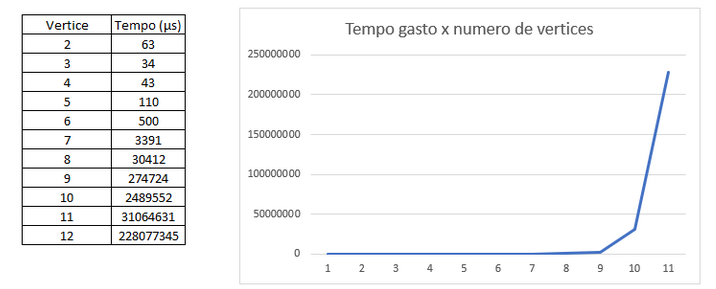

# **Resolução do Problema do Caixeiro Viajante com Força Bruta**
## <ins> O problema </ins>
O problema do caixeiro viajante consiste em descobrir a rota que torna mínima a viagem total, saindo de uma cidade específica e retornando para a mesma. Para isso, foi considerado que cada vértice do grafo se conecta com todos os outros, além de as arestas serem não direcionadas. O problema limita passar mais de uma vez pela mesma cidade. Além disso, nesse código foi limitado um número de criação máximo de 15 vértices, além do peso das arestas serem randômicos. 

 <i> Figura 1: Problema do caixeiro viajante </i>  
 

## <ins> Resolução sem heurística </ins>

No presente [código](resolução.cpp), não foi utilizada uma heurística específica. O intuito foi observar como a resolução do problema se torna limitada por força bruta. Fazendo uma análise, é possível perceber que existen n! permutações para serem checadas, fazendo com que a complexidade do algoritmo seja *O(n!)*. Isso faz com que, com cada vez mais vértices no grafo, o tempo para resolução do problema se eleve consideravelmente. 

## <ins> Resultados </ins>

Foi possível observar que, a partir da utilização de 12 cidades no problema, o tempo de resposta, dado em microssegundos, se tornou consideravelmente grande, como podemos observar no gráfico abaixo: 

 <i> Gráfico 1: Análise do tempo gasto x número de vértices </i>  
 

Para se ter uma noção, convertendo de microssegundos para segundos, temos que, com 10 vértices, o tempo gasto seria de, aproximadamente, 2,49 segundos. Com 12 vértices, o tempo gasto seria de, aproximadamente, 228,078 segundos. É possível ver, graças a complexidade do problema, como o tempo aumenta de forma fatorial a cada inserção de um novo vértice. 

